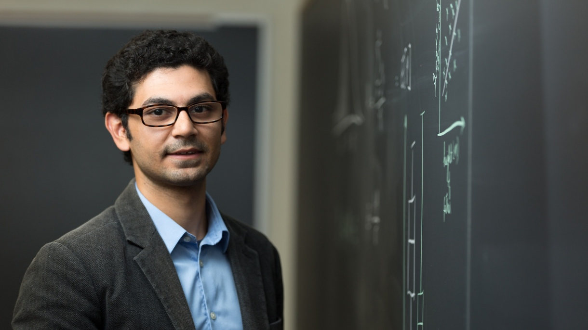

```{r setup, include=FALSE}
knitr::opts_chunk$set(echo = FALSE)
knitr::opts_knit$set(root.dir = '/Users/Serena/Desktop/Summer Research Documents/')
```

# Serena Smith 
```{r}
# knitr::include_graphics("/Users/Serena/Desktop/Head Shot.png")

```


Serena is an Applied Mathematics Major at Bucknell University and intends to graduate in May of 2022. She has lived just 20 minues outside of Pittsburgh, PA her entire life. Growing up, she witnessed gentrification first hand, so when she was presented with the opportunity to conduct research under Professor Owais Gilani in the summer of 2021, she decided to look into the controversial topic of gentrification right in her own backyard.  

# Owais Gilani  



Owais Gilani is an Assistant Professor of Mathematics, specializing in Spacial/Spaciotemporal Statistics at [Bucknell University](https://www.bucknell.edu/fac-staff/owais-gilani). You can find his website [here](https://owaisgilani.weebly.com/).


